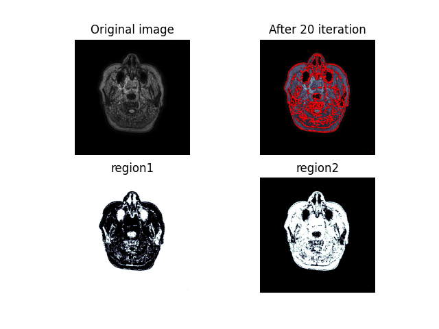

# Lu, Bing-Ze's Segmentation

## Demo
Here is the demo of Lu, Bing-Ze's segmentation method using single-level set.



This result is apply the initial called "Checkerboard"
```math
    \phi_0(x,y) = \frac{\pi}{10} \left(\sin{x}+\cos{y} \right)
```

and the parameters relative to force terms are
```nath
    \lambda_1 = 1, \\
    \lambda_2 = 1.
```


the parameter relative to zero level set is 
```math
    \mu = 10^{-3}
```

## Reference
> Lu, BingZe and Sun, YuanTing and Chen, Ying-Chen and Shu, Yu-Chen, An Efficient Level Set Method Based on a Novel Pixel-Region Dissimilarity Function in Image Segmentation. Available at SSRN: https://ssrn.com/abstract=3976945 or http://dx.doi.org/10.2139/ssrn.3976945 
